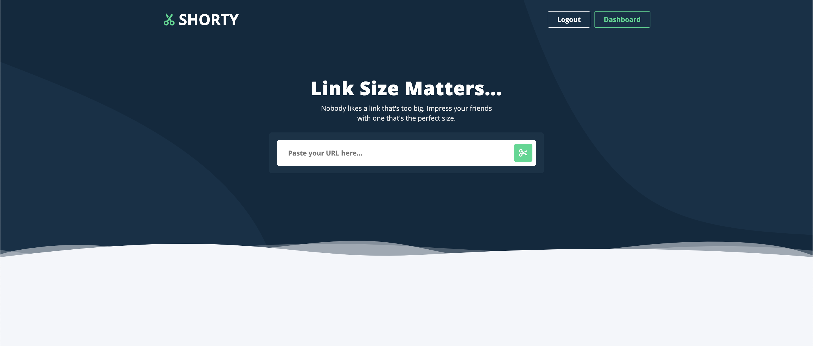

# SHORTY

# Introduction:

Shorty is a URL shortener tool that takes a long and complex URL and converts it into a shorter, more manageable URL. This shortened URL can then be shared and used instead of the original, long URL. The purpose of a URL shortener is to save space and make sharing links more convenient, particularly on platforms with character limits such as Twitter. When someone clicks on the shortened URL, they are redirected to the original, longer URL. Some popular URL shortening services include Bitly, TinyURL, and Google.

There are several benefits to using a short URL:

1. Space-saving: Short URLs take up less space, especially in places with character limits such as social media platforms, making them easier to share and promoting more engagement.
2. Branding: Short URLs can be customized with a brand name or keyword, making it easier to remember and promoting brand recognition.
3. Tracking and Analytics: Many URL shortening services offer tracking and analytics, providing insight into how many clicks a link is receiving, where the clicks are coming from, and other useful information.
4. Masking: Short URLs can hide the destination of a link, making it more difficult for phishing scams and other malicious actors to deceive users.
5. Mobile compatibility: Short URLs can be more mobile-friendly, as they are easier to type or click on smaller screens.

Overall, using a short URL can make sharing and promoting links more convenient, easier to remember, and provide valuable insights for marketers and website owners.

# Technologies Used:

- Visual Sutdio Code
- Mongo DB
- Postman
- React
- Javascript
- CSS
- Express
- dotenv
- Mongoose
- bcrypt
- react-router-dom
- react-scripts
- JWS Tocken /Ajax
- Figma
- Lucid
- Trello

# Getting Started:

[Wire Frame](https://www.figma.com/file/jvfxtQvrHaAasDKCLaA8P0/Bitly?node-id=0%3A1&t=AVtKmAf2Jc8hSJg5-0)

[ERD](https://lucid.app/lucidchart/c039ad48-844f-4ec7-a0ec-915984ccca6a/edit?page=0_0&invitationId=inv_5727775a-102f-465a-aea4-508755e28f33#)

[Trello](https://trello.com/b/qE5MKKid/bitly)

[Heroku](...)

# Installation

To set up your environment, open your terminal use npm i to install all dependencies:

    npm i

Be sure to create a build folder:

    npm run build

# Unsolved Problems: List any unsolved issues.

# Future Enhancements:

- User can generate a custome link
- Link in Bio
- Total Engagement
- QR code generator

# Collaborators:

- Melissa Alzate |
  [GitHub](...) |
  [LinkedIn](...)
- Anthony Ashcraft |
  [GitHub](...) |
  [LinkedIn](...)
- Anthony (Tony) Ingianni |
  [GitHub](...) |
  [LinkedIn](...)
- Rosa Peña |
  [GitHub](https://github.com/rpena124) |
  [LinkedIn](https://www.linkedin.com/in/rpe%C3%B1a/)
